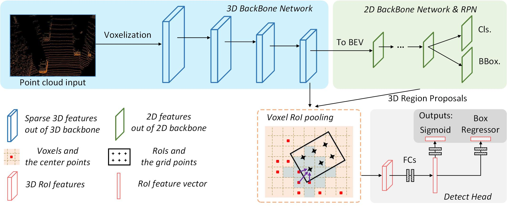

# Voxel R-CNN
<p align="center">  </p>

**Important Update:** The code of Voxel R-CNN in [`OpenPCDet`](https://github.com/open-mmlab/OpenPCDet) is also an official implementation one. Please refer to this repository to find the configs for Waymo Open Dataset.

This is the official implementation of [**Voxel R-CNN: Towards High Performance Voxel-based 3D Object Detection**](https://arxiv.org/abs/2012.15712), built on [`OpenPCDet`](https://github.com/open-mmlab/OpenPCDet).

    @article{deng2020voxel,
      title={Voxel R-CNN: Towards High Performance Voxel-based 3D Object Detection},
      author={Deng, Jiajun and Shi, Shaoshuai and Li, Peiwei and Zhou, Wengang and Zhang, Yanyong and Li, Houqiang},
      journal={arXiv:2012.15712},
      year={2020}
    }

### Installation
1.  Prepare for the running environment. 

    You can either use the docker image we provide, or follow the installation steps in [`OpenPCDet`](https://github.com/open-mmlab/OpenPCDet). 

    ```
    docker pull djiajun1206/pcdet-pytorch1.5
    ```

2. Prepare for the data.

    Please download the official [KITTI 3D object detection](http://www.cvlibs.net/datasets/kitti/eval_object.php?obj_benchmark=3d) dataset and organize the downloaded files as follows (the road planes could be downloaded from [[road plane]](https://drive.google.com/file/d/1d5mq0RXRnvHPVeKx6Q612z0YRO1t2wAp/view?usp=sharing), which are optional for data augmentation in the training):


    ```
    Voxel-R-CNN
    ├── data
    │   ├── kitti
    │   │   │── ImageSets
    │   │   │── training
    │   │   │   ├──calib & velodyne & label_2 & image_2 & (optional: planes)
    │   │   │── testing
    │   │   │   ├──calib & velodyne & image_2
    ├── pcdet
    ├── tools
    ```
    Generate the data infos by running the following command:
    ```
    python -m pcdet.datasets.kitti.kitti_dataset create_kitti_infos tools/cfgs/dataset_configs/kitti_dataset.yaml
    ```

3. Setup.

    ```
    python setup.py develop
    ```

### Getting Started
1. Training.
    
    The configuration file is in tools/cfgs/voxelrcnn, and the training scripts is in tools/scripts.

    ```
    cd tools
    sh scripts/train_voxel_rcnn.sh
    ```

2. Evaluation.

    The configuration file is in tools/cfgs/voxelrcnn, and the training scripts is in tools/scripts.

    ```
    cd tools
    sh scripts/eval_voxel_rcnn.sh
    ```


### Acknowledge
Thanks to the strong and flexible [`OpenPCDet`](https://github.com/open-mmlab/OpenPCDet) codebase maintained by Shaoshuai Shi ([@sshaoshuai](http://github.com/sshaoshuai)) and Chaoxu Guo ([@Gus-Guo](https://github.com/Gus-Guo)).

### Contact
This repository is implemented by Jiajun Deng (dengjj@mail.ustc.edu.cn).
