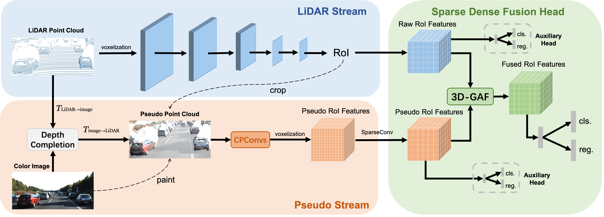

# Sparse Fuse Dense: Towards High Quality 3D Detection with Depth Completion (CVPR 2022, Oral)
<p align="center">  </p>

This is the official implementation of [**Sparse Fuse Dense: Towards High Quality 3D Detection with Depth Completion**](https://arxiv.org/abs/2203.09780), built on [`Voxel-R-CNN`](https://github.com/djiajunustc/Voxel-R-CNN) and [`OpenPCDet`](https://github.com/open-mmlab/OpenPCDet)

    @article{wu2022sparse,
    title={Sparse Fuse Dense: Towards High Quality 3D Detection with Depth Completion},
    author={Wu, Xiaopei and Peng, Liang and Yang, Honghui and Xie, Liang and Huang, Chenxi and Deng, Chengqi and Liu, Haifeng and Cai, Deng},
    journal={arXiv preprint arXiv:2203.09780},
    year={2022}
    }


### Installation
1.  Prepare for the running environment. 

    You can either use the docker image provided by [`Voxel-R-CNN`](https://github.com/djiajunustc/Voxel-R-CNN), or follow the installation steps in [`OpenPCDet`](https://github.com/open-mmlab/OpenPCDet). Our experiments are based on the
    docker provided by Voxel-R-CNN and we use 8 TITAN V GPUs to train our SFD.

2. Prepare for the data.

    Please prepare dataset as [`Voxel-R-CNN`](https://github.com/djiajunustc/Voxel-R-CNN) or [`OpenPCDet`](https://github.com/open-mmlab/OpenPCDet). Then replace corresponding folders and files with those we provide in [[Google](https://drive.google.com/drive/folders/1nrgj1pAYGfNSb3MPLrkuLW27WWyJc68a?usp=sharing
    )|[Baidu](https://pan.baidu.com/s/1uq-xD6e5mGUdYm7ROvV6Jw?pwd=swre)](You need unzip the files with .zip extension before replacing). 
    
    The depth_dense_twise folder contains dense depth maps, and the depth_pseudo_rgbseguv_twise folder contains pseudo point clouds. The depth_pseudo_rgbseguv_twise folder is not uploaded to Google Drive due to the limited capacity of my account. You can download it on Baidu Netdisk or generate it by yourself with depth_dense_twise as follows:

    ```
    cd SFD
    python depth_to_lidar.py
    ```
    
    If you want to generate dense depth maps by yourself, it is recommended to use [`TWISE`](https://github.com/imransai/TWISE). The dense depth maps we provide are generated by TWISE. For convenience, you can directly use [`SFD-TWISE`](https://github.com/LittlePey/SFD-TWISE) to generate dense depth maps. Anyway, you should have your dataset as follows:

    ```
    SFD
    ├── data
    │   ├── kitti_sfd_seguv_twise
    │   │   │── ImageSets
    │   │   │── training
    │   │   │   ├──calib & velodyne & label_2 & image_2 & (optional: planes) & depth_dense_twise & depth_pseudo_rgbseguv_twise
    │   │   │── testing
    │   │   │   ├──calib & velodyne & image_2 & depth_dense_twise & depth_pseudo_rgbseguv_twise
    │   │   │── gt_database
    │   │   │── gt_database_pseudo_seguv
    │   │   │── kitti_dbinfos_train_sfd_seguv.pkl
    │   │   │── kitti_infos_test.pkl
    │   │   │── kitti_infos_train.pkl
    │   │   │── kitti_infos_trainval.pkl
    │   │   │── kitti_infos_val.pkl
    ├── pcdet
    ├── tools
    ```
    Each pseudo point in depth_pseudo_rgbseguv_twise has 9 attributes (x, y, z, r, g, b, seg, u, v). It should be noted that we do not use the seg attribute, because the image segmentation results cannot bring improvement to SFD in our experiments.

3. Setup.

    ```
    cd SFD
    python setup.py develop
    cd pcdet/ops/iou3d/cuda_op
    python setup.py develop
    cd ../../../..
    ```

### Getting Started
1. Training.

    ```
    cd SFD/tools
    scripts/dist_train.sh 8 --cfg_file cfgs/kitti_models/sfd.yaml --gpu_id 0,1,2,3,4,5,6,7
    ```

2. Evaluation.

    ```
    cd SFD/tools
    scripts/dist_test.sh 8 --cfg_file cfgs/kitti_models/sfd.yaml  --gpu_id 0,1,2,3,4,5,6,7 --batch_size 28 \
    --ckpt ../output/kitti_models/sfd/default/ckpt/checkpoint_epoch_40.pth
    ```
    We provide a good checkpoint trained with train split (3712 samples) in [[Google](https://drive.google.com/drive/folders/1nrgj1pAYGfNSb3MPLrkuLW27WWyJc68a?usp=sharing)|[Baidu](https://pan.baidu.com/s/1uq-xD6e5mGUdYm7ROvV6Jw?pwd=swre)].

### Contact
This repository is implemented by Xiaopei Wu (wuxiaopei@zju.edu.cn).
